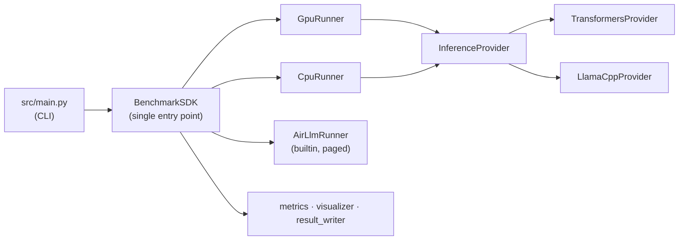
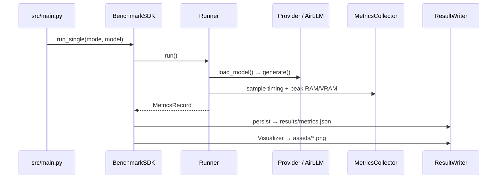
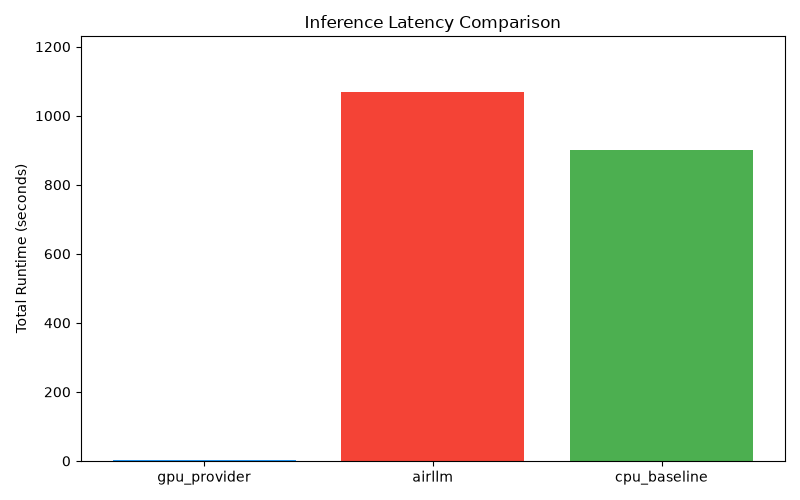
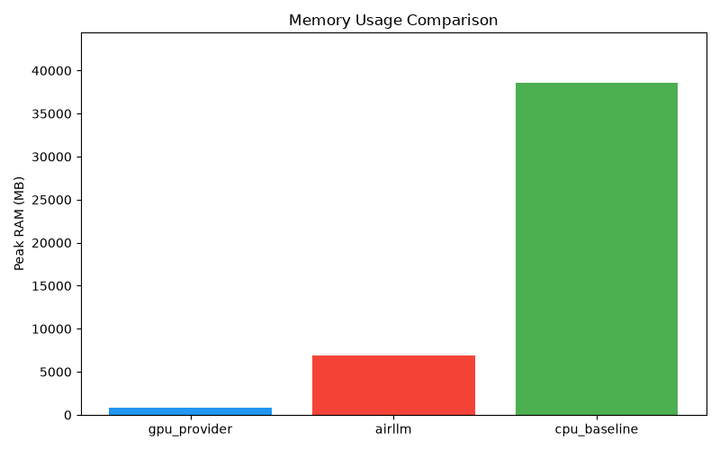
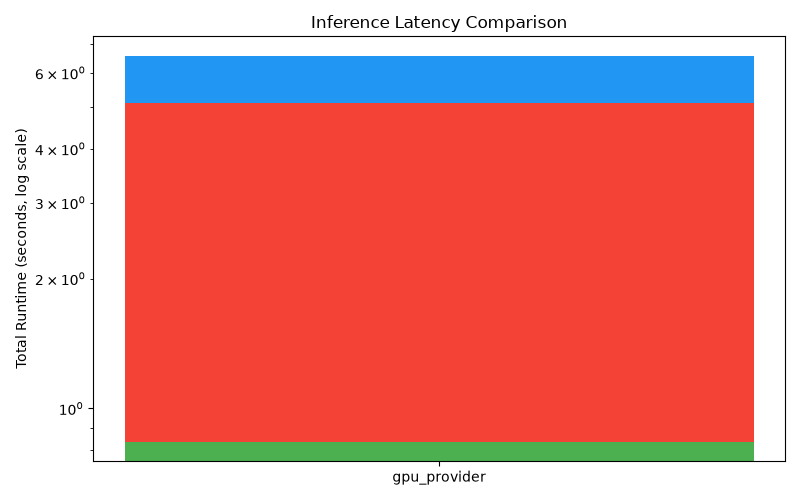
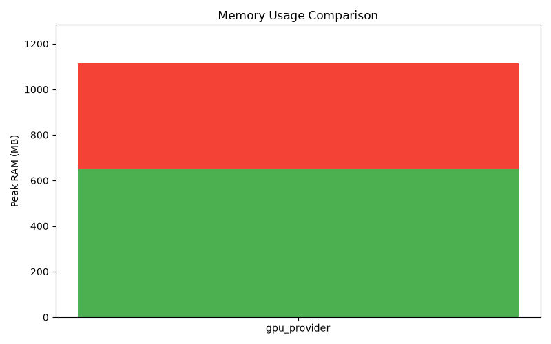

# 🧮 AirLLM Inference Benchmark

[](https://github.com/Us5rName/ai-orchestration-ex5/actions/workflows/ci.yml)


[-success)](docs/AI_USAGE_AND_COST.md)
[](LICENSE)

`LLM inference` · `benchmarking` · `AirLLM` · `GPU vs CPU` · `quantization` · `HuggingFace Transformers` · `llama.cpp`

A reproducible benchmark that proves and quantifies the memory-vs-latency
trade-off of paged LLM inference on real hardware. **[AirLLM](https://github.com/lyogavin/airllm)**
runs models far larger than available memory by streaming weights layer-by-layer
from disk; this repo measures exactly what that buys you — and what it costs.

## Contents

- [Overview — in 30 seconds](#overview--in-30-seconds)
- [What's in this repo](#whats-in-this-repo)
- [How a benchmark run works](#how-a-benchmark-run-works)
- [Configuration at a glance](#configuration-at-a-glance)
- [Results](#results)
- [Cost](#cost)
- [Quick start](#quick-start)
- [Providers / backends](#providers--backends)
- [Quality gates](#quality-gates)
- [Security checks](#security-checks)
- [Attribution](#attribution)
- [License](#license)
- [Status & roadmap](#status--roadmap)
- [Repository facts](#repository-facts)

## Overview — in 30 seconds

The benchmark compares three memory scenarios head-to-head. The **only** variable
that matters is whether the model fits in available memory — not which inference
library is used:

| Scenario | What it shows | Expected outcome |
| --- | --- | --- |
| **Small model on GPU** | Fast baseline — model comfortably fits in VRAM | Low latency, low memory |
| **Large model on raw CPU** | No paging, no compression — model exceeds available RAM | OOM or extreme slowness |
| **Same large model via AirLLM** | Paged + quantized inference | Succeeds, at a steep latency cost |

Everything flows through a single SDK entry point; runners delegate to swappable
providers (facade pattern), while AirLLM has its own builtin paged runner:



See [`docs/PRD.md`](docs/PRD.md) for the full requirements and
[`docs/PLAN.md`](docs/PLAN.md) for the C4 architecture and ADRs.

## What's in this repo

An SDK-first layout — no external consumer imports internal services directly,
and every source file stays under 150 lines (enforced in CI):

| Layer | Modules | Role |
| --- | --- | --- |
| **`sdk/`** | `sdk.py`, `runner.py`, `gpu_runner.py`, `cpu_runner.py`, `airllm_runner.py` | Single entry point + runners (GPU/CPU delegate to a provider; AirLLM is builtin) |
| **`providers/`** | `base.py`, `transformers_provider.py`, `llamacpp_provider.py` | `InferenceProvider` protocol + facades over inference backends |
| **`services/`** | `metrics.py`, `visualizer.py`, `result_writer.py` | Timing + psutil memory sampling, charts/tables, JSON persistence |
| **`shared/`** | `config_loader.py`, `gatekeeper.py`, `cache_check.py`, `version.py` | Config, the API rate-limit gatekeeper, HF-cache checks |

A full per-module line-count inventory is in
[Repository facts](#repository-facts) (machine-generated).

## How a benchmark run works

One benchmark scenario runs as a straight-line pipeline from the CLI through the
SDK to a persisted metrics record and charts:



Two RL-free facts worth stating up front: the benchmark is intentionally
**single-threaded** so peak-memory measurements per run stay uncontaminated
(`shared/gatekeeper.py`), and it **never probes or synthesizes** model
identifiers — everything runs from explicit config.

## Configuration at a glance

All tunable values live in `config/` — zero hardcoding
([`docs/CONFIG.md`](docs/CONFIG.md) has the full schemas):

| File | Key knobs |
| --- | --- |
| `config/experiment.json` | `models` (small `Qwen2.5-0.5B` / medium `3B` / large `32B`), `prompts` (P1–P3), `max_new_tokens` (32), `quantization` (`4bit`), `gpu_provider` / `cpu_baseline_provider` (`transformers`) |
| `config/hardware.json` | Documented benchmark machine — CPU, GPU, RAM, disk, OS (no invented specs) |
| `config/rate_limits.json` | External-call limits enforced by the API Gatekeeper (HuggingFace: 30 calls/min) |

## Results

Actual measured results from this repo's own hardware (see
[`config/hardware.json`](config/hardware.json) and
[`results/metrics_phase8.json`](results/metrics_phase8.json)) — not estimates:

| Scenario | Model | Load/TTFT | Total runtime | Throughput | Peak RAM | Peak VRAM | Status |
| --- | --- | --- | --- | --- | --- | --- | --- |
| GPU baseline | Qwen2.5-0.5B (unquantized) | 0.16s / 3.01s | 3.80s | 40.1 tok/s | 810 MB | 966 MB | ✅ success |
| GPU baseline | Qwen2.5-3B (unquantized) | ~0.3s / ~3s | ~5.47s (avg) | 5.8 tok/s (avg) | 4.6 GB (avg) | ~3.2 GB | ✅ success |
| AirLLM (paged, 4-bit) | Qwen2.5-32B (~65.5GB unquantized) | 604.31s | 1069.60s | 0.1 tok/s | 6.9 GB | 1.9 GB | ✅ success |
| CPU baseline (raw, unquantized) | Qwen2.5-32B | — (never finished loading) | 900s (killed) | — | 38.6 GB (climbing) | n/a | ⏱️ timeout |
| llama.cpp (GGUF, q4_k_m) | Qwen2.5-0.5B-Instruct (small tier) | 0.54s (avg) / — | 4.17s (avg) | 28.0 tok/s (avg) | 0.96 GB (avg) | 0 MB* | ✅ success |






\* The llama.cpp row resolves [`docs/TODO.md`](docs/TODO.md) task 10.1 — the
provider was fully implemented and unit-tested but never actually
benchmarked. It's an opt-in comparison run (`scripts/run_llamacpp_benchmark.py`,
`provider="llamacpp"` explicitly passed to `BenchmarkSDK.run_single`), not part
of the default GPU/CPU/AirLLM matrix. On this machine the installed
`llama-cpp-python` wheel has no CUDA backend (a CUDA-enabled prebuilt wheel
crashed with `SIGILL`, likely an AVX512/CPU-microarch mismatch), so despite
`provider_config.llamacpp.device = "cuda"` these runs executed on CPU — hence
`0 MB` peak VRAM. Raw numbers: `results/metrics_llamacpp.json`.

The AirLLM row is the whole point: a model that needs **~65.5GB unquantized**
runs in **~6.9GB of RAM** via paging — at the cost of ~18 minutes to answer one
short prompt. The CPU-baseline row (same model, no paging, no quantization) was
run under an external memory/timeout watchdog rather than letting it exhaust this
machine's RAM uncontrolled — after 15 minutes it had consumed **38.6GB and
counting** (this sandbox has 0 swap, so the process was stuck in an
uninterruptible disk-I/O wait, not making meaningful progress) and was killed.
That timeout **is** the "OOM or extreme slowness" result the raw-CPU scenario is
supposed to produce (see [`docs/TODO.md`](docs/TODO.md) task 8.3 and
[`docs/PRD.md`](docs/PRD.md) FR-03).

## Cost

Every model here is an open, ungated checkpoint run **locally** — there is **no
per-token or per-API-call dollar cost**. The real currency this benchmark trades
in is **time, memory, and disk** (see the [Results](#results) table).
AI-assisted engineering on this repo was plan-metered (subscription) with no
per-token charge captured.

The full accounting — engineering AI usage, the measured runtime cost ledger, a
hypothetical list-price estimate, and a cost-calculation template — lives in
**[`docs/AI_USAGE_AND_COST.md`](docs/AI_USAGE_AND_COST.md)**.

## Quick start

```sh
uv sync --all-extras
cp .env-example .env   # add your HF_TOKEN
```

```sh
uv run python src/main.py --validate     # dry-run: config, providers, HF cache — no inference
uv run python src/main.py --run-all      # full three-mode benchmark
uv run python src/main.py --single --mode airllm --model small
```

Results are written to `results/metrics.json`; charts and the comparison table
land in `assets/`. The analysis is in
[`notebooks/analysis.ipynb`](notebooks/analysis.ipynb).

## Providers / backends

Both GPU and CPU baseline runners are provider-configurable via
`config/experiment.json`; AirLLM is a builtin runner (no provider):

| Backend | Status | Notes |
| --- | --- | --- |
| **Transformers** | ✅ Wired (default) | HuggingFace `AutoModel*`; GPU and CPU targets; bitsandbytes 4-bit |
| **AirLLM** | ✅ Builtin runner | Layer-by-layer paged inference for the large-model scenario |
| **llama.cpp** | ✅ Wired & benchmarked (opt-in) | `LlamaCppProvider` is complete, unit-tested (36 tests, 100% coverage), registered in `create_provider()`, and now has a real comparison run (`scripts/run_llamacpp_benchmark.py` → `results/metrics_llamacpp.json`) — select via `gpu_provider`/`cpu_baseline_provider` in config, or pass `provider="llamacpp"` directly to `BenchmarkSDK.run_single()` |

## Quality gates

All gates run in CI and via pre-commit; run the suite locally with:

```sh
uv run ruff check src tests scripts
uv run python scripts/check_line_cap.py src tests --limit 150 --mode raw
uv run python scripts/check_line_cap.py scripts --limit 150 --mode logical
uv run python scripts/validate_repo.py
uv run python scripts/check_no_secrets.py
uv run python scripts/check_docs_present.py
uv run python scripts/check_markdown_links.py
uv run python scripts/check_source_archives.py
uv run python scripts/check_planning_ids.py
uv run python scripts/check_workflow_permissions.py
```

## Security checks

A three-tier strategy protects against accidental credential leaks:

1. **Tier 1 (Public):** Generic secret patterns (passwords, API keys) scanned via
   `scripts/check-secrets.py` in pre-commit and CI — transparent, team-wide
2. **Tier 2 (Local-only):** Company-specific patterns in `.git/hooks/pre-commit`
   — private, not committed, customized per developer/org
3. **Tier 3 (Runtime):** Production monitoring for post-breach detection

**Getting started:**
- Generic checks run automatically via pre-commit
- For local-only checks, see [docs/SECURITY_CHECKS.md](docs/SECURITY_CHECKS.md)
  and customize `.git/hooks/pre-commit.template`

## Attribution

This project builds on and benchmarks the following open-source work; it does not
modify or redistribute their weights or code:

- **[AirLLM](https://github.com/lyogavin/airllm)** (Yang, 2023) — the paged
  inference technique under test.
- **[Qwen2.5](https://arxiv.org/abs/2412.15115)** (Qwen Team, Alibaba, 2024)
  — the model family used for all three benchmark scenarios.
- **[HuggingFace Transformers](https://github.com/huggingface/transformers)**
  (Wolf et al., 2020) — the GPU/CPU baseline inference backend.
- **[bitsandbytes](https://github.com/bitsandbytes-foundation/bitsandbytes)**
  — NF4 4-bit ([Dettmers et al., QLoRA, 2023](https://arxiv.org/abs/2305.14314))
  and LLM.int8() ([Dettmers et al., 2022](https://arxiv.org/abs/2208.07339))
  quantization, used by the AirLLM scenario.
- **[llama.cpp](https://github.com/ggml-org/llama.cpp)** /
  [`llama-cpp-python`](https://github.com/abetlen/llama-cpp-python) — an
  additional supported inference provider (see `docs/INCONSISTENCIES.md` #3).

## License

[MIT](LICENSE) — this project's own code. Third-party models and libraries listed
under Attribution above retain their own licenses.

## Authors

- [@evya1](https://github.com/evya1)
- [@Us5rName](https://github.com/Us5rName)

## Status & roadmap

All 50 tasks across 9 phases are complete ([`docs/TODO.md`](docs/TODO.md)
§Summary). All three deferred follow-up items are now resolved
(see [`docs/INCONSISTENCIES.md`](docs/INCONSISTENCIES.md)):

- ✅ **#2** — typed SDK return dataclasses (`BenchmarkSummaryResult`).
- ✅ **#3** — `LlamaCppProvider` wired into `create_provider()` (opt-in).
- ✅ **Parameter sweep** — GPU-baseline sweep executed (small model, P1/P2/P3 ×
  {8, 32, 128} tokens, unquantized). Results in [`results/metrics_sweep.json`](results/metrics_sweep.json).
- ✅ **Medium-tier GPU baseline** — 3B model GPU execution added (P1/P2/P3,
  unquantized). Results in [`results/metrics_medium.json`](results/metrics_medium.json).
  Charts in [`assets/medium/`](assets/medium/).
- ✅ **llama.cpp provider benchmark** — resolves [`docs/TODO.md`](docs/TODO.md)
  task 10.1 (provider was implemented/tested but never run). Small-tier
  (Qwen2.5-0.5B, official GGUF q4_k_m) comparison run added via
  `scripts/run_llamacpp_benchmark.py`. Results in
  [`results/metrics_llamacpp.json`](results/metrics_llamacpp.json). Charts in
  [`assets/llamacpp/`](assets/llamacpp/).

## Repository facts

_Maintained by hand — update when modules, hardware, or the test count change._

**Tests:** 339 collected

**Modules (150-line rule):**

| Module | Lines |
|--------|-------|
| `airllm_benchmark/__init__.py` | 8 |
| `airllm_benchmark/cli_printers.py` | 108 |
| `airllm_benchmark/constants.py` | 37 |
| `airllm_benchmark/providers/__init__.py` | 9 |
| `airllm_benchmark/providers/base.py` | 50 |
| `airllm_benchmark/providers/llamacpp_helpers.py` | 103 |
| `airllm_benchmark/providers/llamacpp_provider.py` | 111 |
| `airllm_benchmark/providers/transformers_helpers.py` | 73 |
| `airllm_benchmark/providers/transformers_provider.py` | 144 |
| `airllm_benchmark/sdk/__init__.py` | 17 |
| `airllm_benchmark/sdk/airllm_generator.py` | 63 |
| `airllm_benchmark/sdk/airllm_loader.py` | 74 |
| `airllm_benchmark/sdk/airllm_runner.py` | 111 |
| `airllm_benchmark/sdk/cpu_runner.py` | 142 |
| `airllm_benchmark/sdk/gpu_runner.py` | 138 |
| `airllm_benchmark/sdk/runner.py` | 113 |
| `airllm_benchmark/sdk/sdk.py` | 150 |
| `airllm_benchmark/sdk/sdk_helpers.py` | 148 |
| `airllm_benchmark/sdk/sdk_summary.py` | 46 |
| `airllm_benchmark/sdk/sdk_validation.py` | 105 |
| `airllm_benchmark/services/__init__.py` | 18 |
| `airllm_benchmark/services/chart_helpers.py` | 112 |
| `airllm_benchmark/services/metrics.py` | 134 |
| `airllm_benchmark/services/metrics_helpers.py` | 111 |
| `airllm_benchmark/services/metrics_sampler.py` | 73 |
| `airllm_benchmark/services/result_writer.py` | 109 |
| `airllm_benchmark/services/table_helpers.py` | 82 |
| `airllm_benchmark/services/visualizer.py` | 115 |
| `airllm_benchmark/shared/__init__.py` | 5 |
| `airllm_benchmark/shared/cache_check.py` | 30 |
| `airllm_benchmark/shared/config.py` | 31 |
| `airllm_benchmark/shared/config_loader.py` | 113 |
| `airllm_benchmark/shared/config_models.py` | 79 |
| `airllm_benchmark/shared/gatekeeper.py` | 69 |
| `airllm_benchmark/shared/version.py` | 6 |

**Benchmark hardware:**
- CPU: AMD Ryzen 9 5950X 16-Core Processor
- GPU: NVIDIA GeForce RTX 3090 24GB
- RAM: 62 GB / Disk free: 1629 GB
- OS: Ubuntu 24.04 LTS
