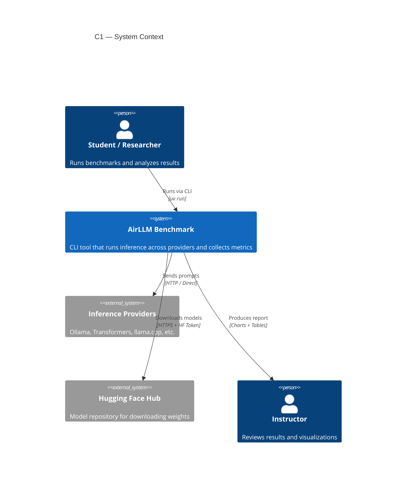
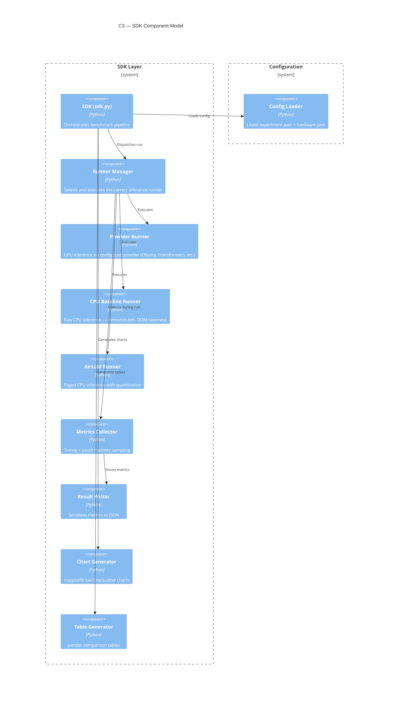
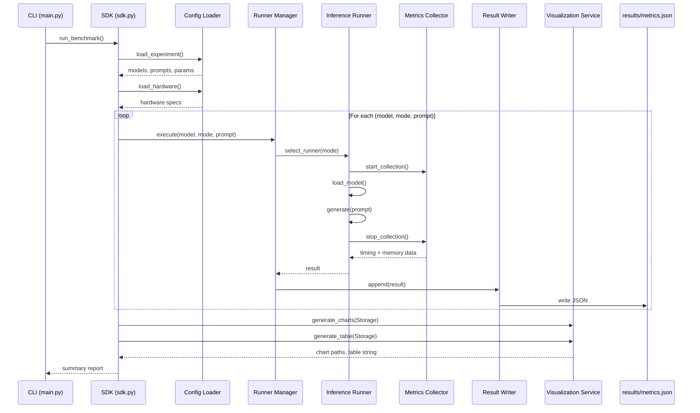

# Architecture Plan — AirLLM Inference Benchmark

| Metadata      | Value                                  |
| ------------- | -------------------------------------- |
| **Version**   | 1.00                                   |
| **Author**    | AI Orchestration Course — Exercise 5   |
| **Created**   | 2026-07-03                             |
| **Status**    | Draft — Awaiting Approval              |
| **Based on**  | `docs/PRD.md` v1.00                    |

---

## 1. C4 Model

### 1.1 Context Diagram (C1)

Shows the system in relation to external actors and systems.



### 1.2 Container Diagram (C2)

Shows the high-level technology containers and their relationships.

```mermaid
C4Container
    title C2 — Container Model

    Person(student, "Student / Researcher")
    System_Ext(inference_providers, "Inference Providers", "Ollama, Transformers, llama.cpp")
    System_Ext(huggingface, "Hugging Face Hub")

    Boundary(app, "AirLLM Benchmark Application") {
        Container(cli, "CLI (main.py)", "Python", "Presentation layer — delegates all logic to SDK")
        Container(sdk, "SDK (sdk.py)", "Python", "Single entry point — orchestrates benchmark runs")
        Container(runners, "Inference Runners", "Python", "Provider-agnostic runners: GPU provider, CPU baseline, AirLLM")
        Container(metrics_svc, "Metrics Service", "Python", "Collects timing and memory data via psutil")
        Container(viz_svc, "Visualization Service", "Python", "Generates charts and tables via matplotlib/pandas")
        ContainerDb(results_db, "Results Storage", "JSON", "metrics.json — structured benchmark results")
    }

    Boundary(config, "Configuration") {
        ContainerFile(experiment_cfg, "experiment.json", "JSON", "Models, prompts, max_tokens, quantization")
        ContainerFile(hardware_cfg, "hardware.json", "JSON", "Documented hardware specs")
        ContainerFile(env_file, ".env", "Env", "HF_TOKEN secret")
    }

    Rel(student, cli, "Executes", "uv run")
    Rel(cli, sdk, "Delegates to", "SDK API")
    Rel(sdk, runners, "Invokes", "Method call")
    Rel(sdk, metrics_svc, "Requests", "Method call")
    Rel(sdk, viz_svc, "Requests", "Method call")
    Rel(runners, inference_providers, "Sends prompts", "HTTP / Direct")
    Rel(runners, huggingface, "Downloads models", "HTTPS")
    Rel(metrics_svc, results_db, "Writes", "JSON")
    Rel(viz_svc, results_db, "Reads", "JSON")
    Rel(sdk, experiment_cfg, "Reads", "File I/O")
    Rel(sdk, hardware_cfg, "Reads", "File I/O")
    Rel(runners, env_file, "Reads token", "Environment")
```

### 1.3 Component Diagram (C3)

Shows the internal components of the SDK layer.



### 1.4 Code-Level Structure (C4)

```
src/airllm_benchmark/
├── __init__.py
├── sdk/
│   ├── __init__.py
│   ├── sdk.py                  # Single entry point
│   ├── runner.py               # Runner manager (selects mode)
├── provider_runner.py      # Configurable GPU provider runner
├── cpu_runner.py           # Raw CPU baseline runner
│   └── airllm_runner.py        # AirLLM paged runner
├── services/
│   ├── __init__.py
│   ├── metrics.py              # Timing + psutil memory sampling
│   └── visualizer.py           # Chart + table generation
├── shared/
│   ├── __init__.py
│   ├── config.py               # Config loader (JSON + .env)
│   └── version.py              # Version tracking (1.00)
└── constants.py                # Enums, physical constants

config/
├── experiment.json             # Models, prompts, max_tokens, quantization
└── hardware.json               # Documented hardware specs

results/
└── metrics.json                # Collected benchmark results

tests/
├── unit/
│   ├── test_config.py
│   ├── test_metrics.py
│   └── test_visualizer.py
└── integration/
    └── test_pipeline.py
```

---

## 2. Sequence Diagram — Benchmark Execution

Shows the flow of a single benchmark run across all three modes.



---

## 3. Data Schema

### 3.1 Metrics Record (JSON)

Each inference run produces one record appended to `results/metrics.json`.

| Field              | Type     | Description                                    |
| ------------------ | -------- | ---------------------------------------------- |
| `run_id`           | string   | Unique identifier (e.g., `run_001`)            |
| `model`            | string   | HuggingFace model identifier                   |
| `mode`             | string   | `"gpu_provider"`, `"cpu_baseline"`, `"airllm"`  |
| `provider`         | string   | Provider name (e.g., `"ollama"`, `"transformers"`) |
| `prompt`           | string   | Input prompt text                              |
| `prompt_id`        | string   | Prompt identifier (P1, P2, P3)                 |
| `quantization`     | string   | `"4bit"`, `"8bit"`, or `"none"`                |
| `max_new_tokens`   | integer  | Token generation limit                         |
| `load_time_s`      | float    | Seconds to load model into memory              |
| `ttft_s`           | float    | Time to first token (seconds)                  |
| `total_runtime_s`  | float    | Total inference time (seconds)                 |
| `tokens_generated` | integer  | Number of tokens produced                      |
| `peak_ram_mb`      | float    | Peak RAM usage during inference (MB)           |
| `peak_vram_mb`     | float    | Peak VRAM usage during inference (MB, if GPU)  |
| `status`           | string   | `"success"`, `"oom"`, `"timeout"`              |
| `error`            | string   | Error message if status != `"success"`         |
| `timestamp`        | string   | ISO 8601 timestamp of run                      |

### 3.2 Configuration — `config/experiment.json`

```json
{
  "models": {
    "small": { "id": "meta-llama/Llama-3.2-1B", "tier": "small" },
    "medium": { "id": "Qwen/Qwen2.5-7B-Instruct", "tier": "medium" },
    "large": { "id": "Qwen/Qwen2.5-72B-Instruct", "tier": "large" }
  },
  "prompts": {
    "P1": "What is the capital of the United States?",
    "P2": "Explain quantum entanglement in one paragraph.",
    "P3": "Write a Python function that sorts a list."
  },
  "max_new_tokens": 32,
  "quantization": "4bit",
  "gpu_provider": "ollama",
  "provider_config": {
    "ollama": { "base_url": "http://localhost:11434" },
    "transformers": { "device": "cuda" }
  }
}
```

### 3.3 Configuration — `config/hardware.json`

```json
{
  "cpu": "",
  "gpu": "",
  "ram_gb": 0,
  "disk_free_gb": 0,
  "os": "",
  "documented_by": "",
  "documented_at": ""
}
```

> All fields must be filled before running benchmarks. Empty values cause the SDK to abort with a clear error.

---

## 4. SDK API Contract

### 4.1 Entry Point — `sdk.py`

```python
class BenchmarkSDK:
    """Single entry point for all benchmark operations."""

    def run_benchmark(self) -> dict:
        """Execute full benchmark pipeline across all modes.

        Returns:
            dict with keys: summary, chart_paths, table_text
        """

    def run_single(self, model_id: str, mode: str, prompt: str) -> dict:
        """Run a single inference and return metrics.

        Args:
            model_id: HuggingFace model identifier
            mode: one of "gpu_provider", "cpu_baseline", "airllm"
            provider: inference provider for GPU mode (default: "ollama")
            prompt: input text

        Returns:
            dict matching Metrics Record schema
        """

    def generate_visualization(self) -> list[str]:
        """Generate charts and tables from stored metrics.

        Returns:
            List of file paths to generated assets
        """
```

### 4.2 Runner Interface

All runners implement this interface:

```python
class InferenceRunner(Protocol):
    """Interface for all inference runners."""

    def load_model(self, model_id: str) -> None: ...
    def generate(self, prompt: str, max_tokens: int) -> str: ...
    def unload(self) -> None: ...
```

---

## 5. Architectural Decision Records (ADRs)

### ADR-001: SDK-First Architecture

**Status:** Accepted  
**Date:** 2026-07-03

**Context:** The project requires clean separation between presentation (CLI) and business logic (benchmark execution).

**Decision:** All business logic resides in `sdk/sdk.py`. The CLI is a thin wrapper that delegates to the SDK. No external consumer imports internal services directly.

**Consequences:**
- Pros: Testable core logic, reusable SDK, clear boundaries
- Cons: Slight overhead of delegation layer

### ADR-002: JSON for Results Storage

**Status:** Accepted  
**Date:** 2026-07-03

**Context:** Need to store benchmark results in a format that is both human-readable and easily parsable for visualization.

**Decision:** Use `results/metrics.json` as a JSON array of records. Each run appends one record.

**Consequences:**
- Pros: No database dependency, easy to inspect, pandas-compatible
- Cons: Not suitable for concurrent writes (not a concern for this exercise)

### ADR-003: Separate Runners per Mode

**Status:** Accepted  
**Date:** 2026-07-03

**Context:** Each inference scenario (GPU provider, raw CPU baseline, AirLLM) has fundamentally different loading and generation logic. The GPU provider should be configurable (Ollama, Transformers, etc.) since providers support both GPU and CPU.

**Decision:** Implement three separate runner classes, each implementing the `InferenceRunner` protocol. The GPU provider runner is configured via `experiment.json` and can target any supported provider. A runner manager selects the correct runner based on mode.

**Consequences:**
- Pros: Clean separation, easy to add new modes, testable in isolation
- Cons: Some duplication in model loading boilerplate (mitigated by shared utilities)

### ADR-004: Configuration via JSON + .env

**Status:** Accepted  
**Date:** 2026-07-03

**Context:** All tunable values must be externalized per project rules. Secrets must never appear in code.

**Decision:** Experiment parameters in `config/experiment.json`, hardware specs in `config/hardware.json`, secrets (HF_TOKEN) in `.env`.

**Consequences:**
- Pros: Reproducible experiments, no hardcoded values, secrets protected
- Cons: Config loader adds a dependency layer

### ADR-005: psutil for Memory Monitoring

**Status:** Accepted  
**Date:** 2026-07-03

**Context:** Need to measure RAM usage during inference without adding significant overhead.

**Decision:** Use `psutil` to sample process memory at 1-second intervals during inference. Record peak value.

**Consequences:**
- Pros: Lightweight, cross-platform, well-tested
- Cons: Sampling may miss brief spikes (acceptable for this exercise)

---

## 6. Deployment Model

```mermaid
C4Deployment
    title Deployment Model

    Person_Boundary(user, "Student") {
        Person(operator, "Student / Researcher")
    }

    System_Boundary(machine, "Local Machine") {
        System_Boundary(app_env, "uv Virtual Environment") {
            Container(cli_app, "CLI Application", "Python 3.12+", "Entry point")
            Container(sdk_lib, "SDK Library", "Python", "Benchmark logic")
        }
        ContainerDb(json_store, "results/metrics.json", "JSON File")
        ContainerFolder(assets_dir, "assets/", "Generated charts")
    }

    System_Boundary(external, "External Services") {
        System(inference_svc, "Inference Providers", "Ollama, Transformers, llama.cpp, etc.")
        System(hf_hub, "Hugging Face Hub", "Model downloads")
    }

    Rel(operator, cli_app, "Runs", "uv run")
    Rel(cli_app, sdk_lib, "Uses", "Import")
    Rel(sdk_lib, json_store, "Writes", "File I/O")
    Rel(sdk_lib, assets_dir, "Writes", "File I/O")
    Rel(sdk_lib, inference_svc, "Queries", "HTTP / Direct")
    Rel(sdk_lib, hf_hub, "Downloads", "HTTPS")
```

---

## 7. Error Handling Strategy

| Scenario                      | Behavior                                          |
| ----------------------------- | ------------------------------------------------- |
| Hardware config not filled    | SDK aborts with clear error listing empty fields  |
| Configured provider unavailable | Log warning, mark run as `"timeout"`, continue  |
| OOM during CPU baseline       | Catch exception, record `"oom"` status, continue  |
| AirLLM model download fails   | Retry once, then record `"timeout"`, continue     |
| HF_TOKEN missing for gated model | Abort with instruction to set `.env`           |
| Invalid config JSON           | Abort with parse error and file path              |

---

## 8. Testing Strategy

| Test Type       | Scope                                           | Tool        |
| --------------- | ----------------------------------------------- | ----------- |
| **Unit**        | Config loader, metrics collector, visualizer    | `pytest`    |
| **Integration** | Full pipeline run with small model              | `pytest`    |
| **Smoke**       | Ollama connectivity, AirLLM import              | Manual      |

**Coverage target:** ≥ 85% (statement, branch, critical path). External dependencies (Ollama, HF Hub) are mocked.
